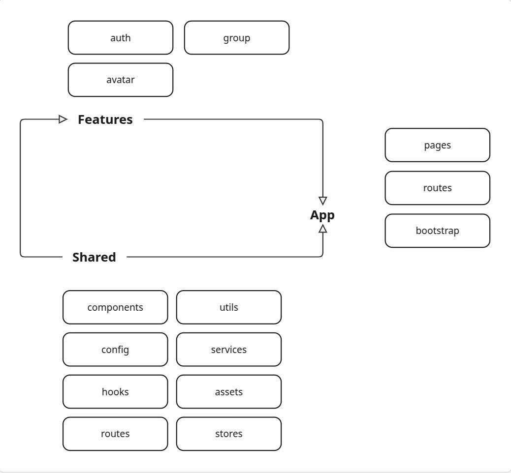

## 🧪 **Flow of imports and dependencies**

This flow illustrates how dependencies circulate in our code, which is crucial for ensuring the maintainability of the application.

> It is important to note that all `shared` files can be imported into `src/app` and `src/features`, but not the other way around.

Let's take the example of the `LoginPage` screen, located in the `src/app/pages` folder. This screen is imported into `src/routes`.

### Component dependency

The `LoginPage` screen may require other components:

- **Screen-specific components**: If these components are only used by `Login`, they can remain in the same file as long as it does not impact readability. Otherwise, move them to `/src/app/auth/components`.

- **Reusable components**: If these components are needed in other screens, it is better to place them in the `/src/components` folder.

### Managing hooks and reusable logic

Similarly, if certain logic is used in multiple parts of the application, we can create a hook in `/src/hooks`. Otherwise, move it to `/src/app/auth/hooks` for better organization.

### Using modules for maintainability

To improve maintainability, we adopt the concept of modules. When refactoring is performed within a module, as long as the API of the exported functions or components remains unchanged, we minimize the risk of regression.

### Conclusion

By following these practices, we ensure that our application remains modular, maintainable, and easily extensible.

---
